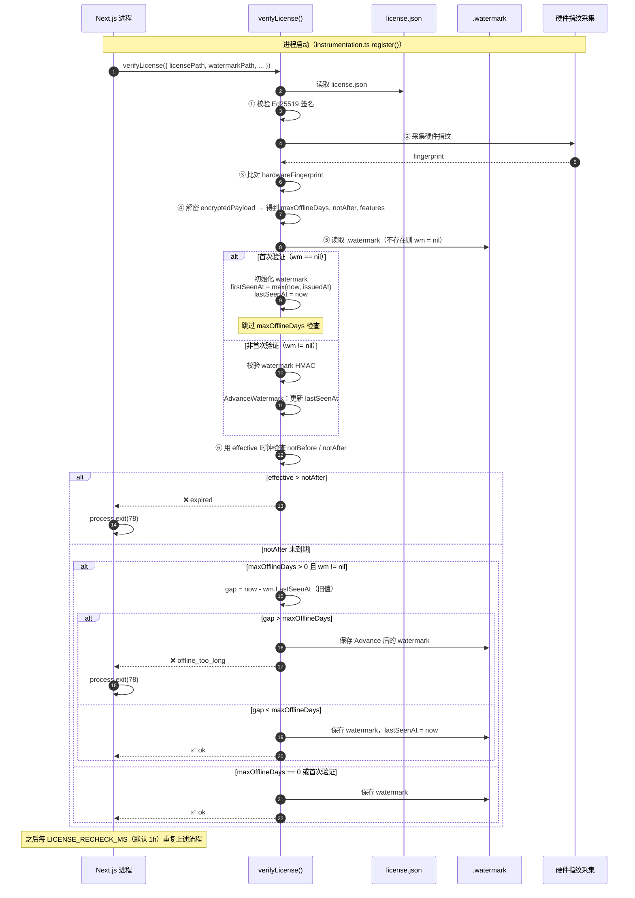
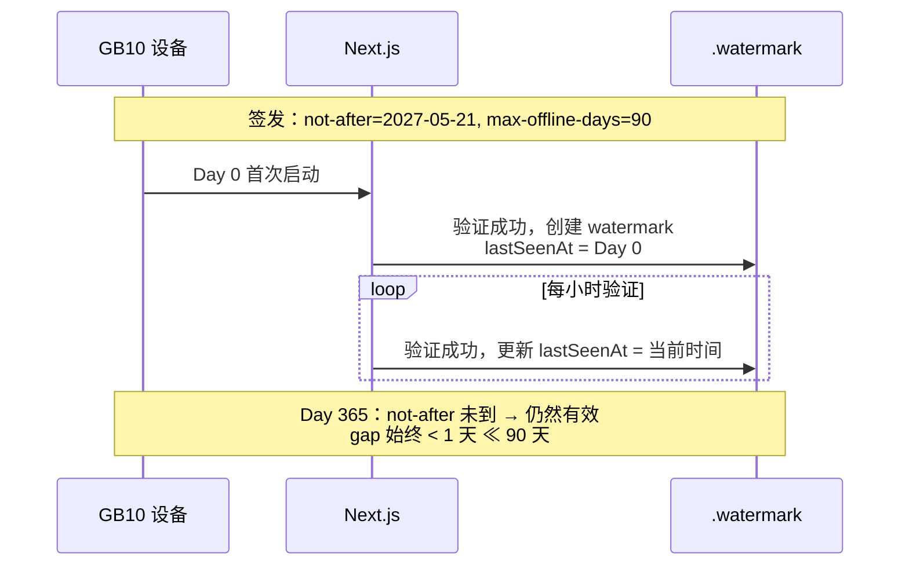
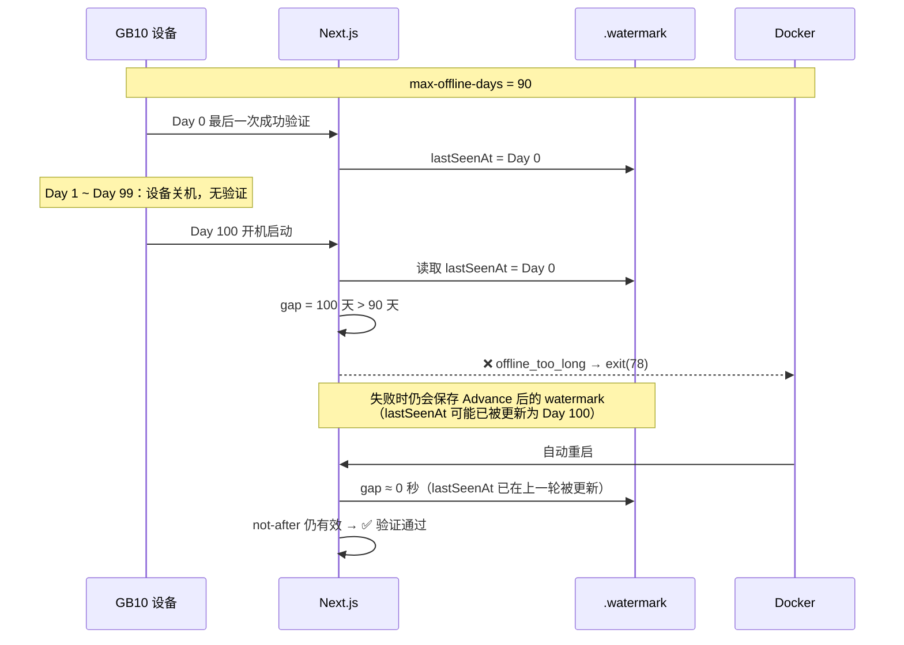
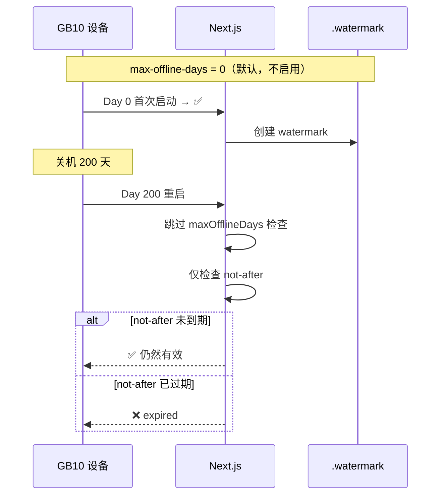
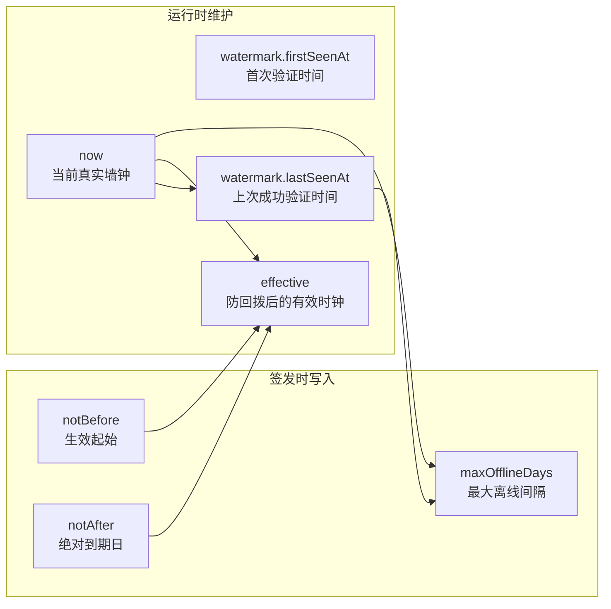

# `-max-offline-days` 参数说明

本文档说明签发 License 时 `-max-offline-days` 参数的含义、与 `-not-after` 的区别、和 `.watermark` 水位文件的协作关系，以及在不同部署场景下的实际行为。

> 相关代码：`internal/license/verify.go`（第 8 步离线时长检查）、`internal/license/watermark.go`、`cmd/issuer/main.go`（`-max-offline-days` 参数）。

---

## 一句话总结

`-max-offline-days` 是**签发 License 时**写入加密载荷（`payload.maxOfflineDays`）的数字，表示：

> **从「上一次成功验证」到「这次验证」，真实系统时间最多允许间隔多少天。**

超过这个间隔，即使 `notAfter`（绝对到期日）还没到，验证也会失败，返回 `offline_too_long`。

> **永久授权（`-permanent` / v4 `expires=false`）不适用此参数**：`issuer sign` 强制要求永久授权下 `-max-offline-days=0`，验证器也会跳过第 9 步检查。永久授权只通过硬件指纹和 watermark 完整性保护，不再有「定期回到内网续期」的硬约束。

---

## 与 `-not-after` 的区别

这两个参数控制的是**两件不同的事**：

| 参数 | 含义 | 类比 |
|------|------|------|
| `-not-after` | License **绝对到期日** | 合同写「2027-05-21 失效」 |
| `-max-offline-days` | **两次成功验证之间**允许的最大真实时间间隔 | 「最多连续 N 天没成功跑过验证」 |

签发示例：

```bash
./build/issuer sign \
  -hardware ./hardware.json \
  -priv ./private.pem \
  -licensee "ACME Corp" \
  -not-after 2027-05-21 \        # 硬到期：2027-05-21 之后一定失效
  -max-offline-days 90 \         # 软约束：距上次成功验证不能超过 90 天
  -out license.json
```

- **`not-after`**：不管设备开不开机，到日子就过期。
- **`max-offline-days`**：不管 `not-after` 还有多远，如果「太久没成功验过一次」，也会判失效。
- **设为 `0`（默认）**：不启用离线时长限制，只受 `not-after` 约束。

---

## 依赖的机制：`.watermark` 水位文件

每次**验证成功**，验证器会更新设备上的 `.watermark` 文件，其中 `lastSeenAt` 记录「上次成功验证时的真实时间」：

```json
{
  "licenseId": "lic_...",
  "firstSeenAt": "2026-05-22T08:00:00Z",
  "lastSeenAt":  "2026-05-22T14:00:00Z",
  "verifyCount": 42,
  "timeRewindCount": 0,
  "mac": "<HMAC-SHA256，防篡改>"
}
```

验证流程中与时间相关的检查顺序（简化）：

1. 签名校验、硬件指纹匹配、解密 payload
2. 读取并校验 `.watermark` 的 HMAC
3. `AdvanceWatermark`：更新单调时钟（防时间回拨）
4. 用 **effective 时钟**检查 `notBefore` / `notAfter`
5. 用 **真实墙钟**检查 `maxOfflineDays`（仅当 watermark 已存在且 `maxOfflineDays > 0`）
6. 验证成功 → 持久化更新后的 watermark

关键实现（`internal/license/verify.go`）：

```go
// 第 8 步：离线时长上限
// 注意：比较的是真实墙钟 now，不是防回拨后的 effective 时钟
if payload.MaxOfflineDays > 0 && wm != nil {
    gap := now.Sub(wm.LastSeenAt)   // 用的是 Advance 之前的旧 lastSeenAt
    if gap.Hours()/24 > float64(payload.MaxOfflineDays) {
        return emit(ReasonOfflineTooLong, ...)
    }
}
```

要点：

| 要点 | 说明 |
|------|------|
| 用真实墙钟 | 比较 `now` 与旧的 `wm.LastSeenAt`，不用 `effective` |
| 首次验证跳过 | `wm == nil` 时不做此项检查（第一次启动不受限） |
| 写入加密 payload | 值在 AES-256-GCM 加密层内，外部改 license 头部无效 |
| HMAC 保护 | watermark 由硬件指纹派生密钥保护，不可随意伪造 |

---

## 总览时序图

下面这张图展示 **Next.js 启动验证** 时，`not-after`、`max-offline-days`、`.watermark` 三者的协作关系：



---

## 场景时序图

### 场景 A：设备 7×24 运行（正常运行）

设备持续开机，Next.js 每小时验证一次。`lastSeenAt` 持续刷新，`max-offline-days` 不会触发。



**结论**：设备一直正常运行时，`max-offline-days` 基本无感。它不是「每 N 天必须联网续期」——断网场景下本来也没有在线续期。

---

### 场景 B：设备关机超过 N 天后重启

设备长时间停机，`lastSeenAt` 停留在关机前的时刻，重启后 gap 超过阈值。



**结论**：`max-offline-days` 主要约束**长时间停机 / 长时间未成功验证**。对持续运行的设备影响很小。

> **实现细节**：验证失败时代码仍会保存 Advance 后的 watermark。因此「关机 100 天后第一次启动」可能先失败一次，Docker 自动重启后第二次通过——更像**唤醒告警**，不一定会永久锁死。真正硬锁的是 `not-after` 过期和硬件指纹不匹配。

---

### 场景 C：只设 `not-after`，不设离线限制（默认）



---

## 三个时间概念对照



| 时间变量 | 来源 | 用途 |
|----------|------|------|
| `notBefore` / `notAfter` | license.json（签名保护） | 用 **effective** 时钟判断绝对有效期 |
| `maxOfflineDays` | 加密 payload 内 | 用 **真实墙钟** 与旧 `lastSeenAt` 算 gap |
| `lastSeenAt` | .watermark（HMAC 保护） | 记录上次成功验证的真实时间 |
| `effective` | AdvanceWatermark 计算 | 单调递增，抵御系统时钟回拨 |

---

## 为什么要设计这个参数？

GB10 等设备是**断网、离线**运行，系统**不支持在线吊销**。若只设一个很远的 `not-after`（比如 10 年），客户可以一直用到到期，中间完全不需要再接触。

`-max-offline-days` 在离线前提下增加一层**活跃性 / 接触性**约束：

1. **长期封存再启用**：关机超过 N 天再开，需要先处理（换 license、人工介入）。
2. **运维侧定期接触客户**：README 建议无人值守工业设备 180 天；需要更频繁接触的场景 30–60 天。
3. **与 watermark 配合**：不只看可被篡改的系统时钟，而是看「距上次成功验证过了多久」。

在 GB10 **持续运行**的场景里，它**不会**强迫客户每 N 天找你续一次；只有**长时间停机**或**长时间验证失败**才会触发。

---

## 参数选择建议

| 场景 | 建议值 | 说明 |
|------|--------|------|
| GB10 长期在线、无人值守 | `0` 或 `180` | 默认 `0` 最简单；`180` 防极端长期停机 |
| 希望客户定期回来续签 | `30` ~ `90` | 长期关机后再开可能触发告警 |
| 试用 / POC 设备 | `7` ~ `30` | 短周期试用 |
| 完全不想管这项 | `0` | 只靠 `not-after` 控制到期 |

对当前 GB10 断网部署：

- 设备**几乎一直开机** → 设 `90` 或 `180` 主要是防「封存太久再启用」；设 `0` 也完全合理。
- 设备**经常长期关机** → 设一个合理值，避免客户把 license 用在封存设备上。

---

## 与「续期」的关系

此处的「续期」**不是联网激活**，而是运维流程：

1. 内网用 `issuer sign` 签一份**新 license**（可延长 `not-after`）
2. 拷贝到设备 `./license/license.json`
3. 若 license ID 变更，通常需删除或重置 `.watermark`

`-max-offline-days` 不会自动续期；它只是说：**如果太久没成功验证过，旧 license 也会被判无效**，从而推动运维/商务侧介入。

---

## 验证失败原因速查

| reason | 含义 | 是否与 max-offline-days 相关 |
|--------|------|------------------------------|
| `ok` | 验证通过 | — |
| `expired` | 超过 `notAfter` | 否（绝对到期） |
| `offline_too_long` | 距上次成功验证超过 `maxOfflineDays` | **是** |
| `time_rewind` | 系统时钟回拨次数过多 | 否（watermark 防篡改） |
| `fingerprint_mismatch` | 硬件变更 | 否 |
| `signature_invalid` | license 被篡改 | 否 |

---

## 相关文件

| 文件 | 作用 |
|------|------|
| `cmd/issuer/main.go` | `-max-offline-days` 签发参数 |
| `internal/license/issue.go` | 写入 `payload.maxOfflineDays` |
| `internal/license/verify.go` | 第 8 步离线时长检查 |
| `internal/license/watermark.go` | `lastSeenAt` 维护与 HMAC |
| `verifier-node/src/verify.ts` | Node.js 端镜像逻辑 |
| `examples/nextjs/instrumentation.ts` | Next.js 启动时调用验证 |

---

## 延伸阅读

- [硬件指纹采集说明](hardware-fingerprint.md)
- [README — 端到端流程](../README.md)
